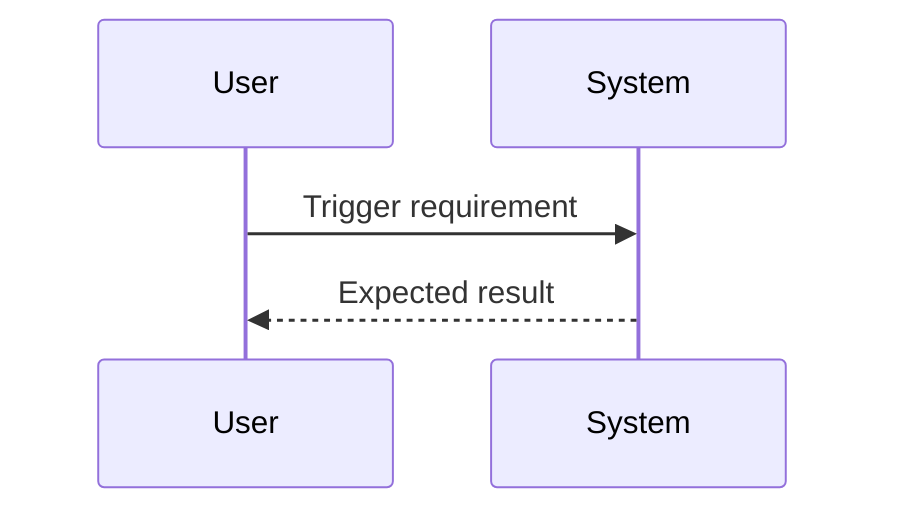

# 设计文档：{{name}}（{{slug}}）

Spec Type: {{spec_type}}
Workflow: {{workflow}}
Status: Design Draft
Review Status: unreviewed

## 概述

{{summary}}

## 架构

### 现有架构

```text
待根据项目代码补充。
```

### 目标架构

```text
待根据已确认需求或技术设计补充。
```

## 组件与接口

### 1. `待确认组件`

**职责**：待根据代码结构确认。

**变更**：

- 待补充。

## 数据模型

待确认是否需要新增或修改数据结构、配置、数据库、文件格式或迁移。

## 流程



## 错误处理

- 待补充错误场景和处理方式。

## 安全与隐私

- 待确认鉴权、权限、输入校验、敏感信息和隐私数据影响。

## 性能与可靠性

- 待确认延迟、吞吐、并发、重试、幂等和降级要求。

## 测试策略

- 单元测试：待补充。
- 集成测试：待补充。
- 端到端测试：待补充。
- 回归测试：待补充。
- 属性测试候选：待补充。

## 正确性属性

### 属性 1：需求行为保持

*对任意* 满足前置条件的输入，当用户触发该能力，系统应满足对应验收标准。

**验证：需求 1**

## 风险

- 需求或设计细节尚未确认：在进入 coding 前需要用户 review。

## 待确认问题

- 需要补充哪些具体组件、接口、测试和验收命令？
- 是否确认当前技术设计？确认后再继续生成 `tasks.md`。
