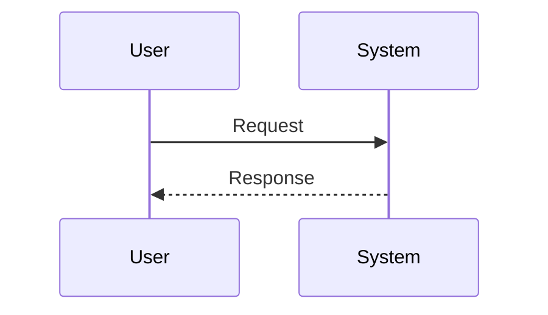

# Spec Document Templates

5 份 spec 文档的章节模板与 EARS SHALL 写法。`spec-writer` agent（工具白名单 `Read, Write, Edit, Grep, Glob`，无 Bash）按本文件生成文档。tasks.md 末尾自带 `## 测试要点` 节，spec-writer 在 tasks phase 按 SHALL 补几行作为测试人员参考。

## 0. 命名约定

| 文件 | 用途 | 互斥关系 |
|---|---|---|
| `requirements.md` | 需求-first / design-first 工作流的需求文档 | 与 `bugfix.md` 互斥 |
| `bugfix.md` | bugfix 工作流的问题描述 | 与 `requirements.md` 互斥 |
| `design.md` | 技术设计文档 | — |
| `tasks.md` | 任务拆分 + 进度 + traceability + 末尾 `## 测试要点`（spec-writer tasks phase 按 SHALL 顺手补充，给测试人员参考） | — |
| `implementation-log.md` | 实现记录（可选） | — |

每份文档头部固定四行 metadata：

```text
Spec Type: <Feature | Bugfix>
Workflow: <requirements-first | design-first | bugfix>
Status: <Requirements Draft | Bug Analysis Draft | Design Draft | Tasks Draft | Implementation Log>
Review Status: <unreviewed | reviewed | accepted>
```

## 1. `requirements.md`

```markdown
# 需求文档：[需求显示名]（[slug]）

Spec Type: Feature
Workflow: <requirements-first | design-first>
Status: Requirements Draft
Review Status: unreviewed

## 简介

[说明要实现的能力、用户价值、当前背景。若已有代码上下文，简述相关模块和约束。]

---

## 词汇表

- **[Term]**：[定义]
- **[Term]**：[定义]

---

## 需求

### 需求 1：[需求标题]

**用户故事：** 作为 [用户/角色]，我希望 [能力]，以便 [价值]。

#### 验收标准

1.1 WHEN [触发条件]，THE [系统/组件] SHALL [期望行为]。
1.2 IF [条件]，THEN THE [系统/组件] SHALL [期望行为]。
1.3 WHILE [状态]，THE [系统/组件] SHALL [持续行为]。

### 需求 2：[需求标题]

**用户故事：** 作为 ...

#### 验收标准

2.1 WHEN ...
2.2 IF ... THEN ...

---

## 边界情况

1. WHEN [边界条件]，THE [系统/组件] SHALL [安全行为]。
2. WHEN [边界条件]，THE [系统/组件] SHALL [安全行为]。

---

## 非功能需求

1. WHEN [运行条件]，THE [系统/组件] SHALL [可验证的质量要求]。
2. WHEN [运行条件]，THE [系统/组件] SHALL [可验证的质量要求]。

---

## 待确认问题

- [问题]
- [问题]
```

约束：

- SHALL 必须按 `<需求编号>.<条目编号>` 编号（如 `1.1` / `2.3`）—— tasks.md 的 `_需求：x.y_` 用同一编号系统 traceback。
- 「待确认问题」节是给"用户回头要确认"用的；澄清 wizard 解决不了的可延后项写在这里。
- 避免使用「假设」/「Assumptions」 节 —— 用 `待确认问题` 主动问，不要假设。

## 2. `bugfix.md`

```markdown
# Bugfix 文档：[问题显示名]（[slug]）

Spec Type: Bugfix
Workflow: bugfix
Status: Bug Analysis Draft
Review Status: unreviewed

## 问题摘要

[一句话说明缺陷：发生在哪、谁受影响、什么时间复现的。]

## 复现步骤

1. [步骤]
2. [步骤]
3. [步骤]
4. [观察到的错误结果]

## 当前行为

1.1 WHEN [触发条件]，THE [系统/组件] [错误行为]。
1.2 WHEN [触发条件]，THE [系统/组件] [错误行为]。

## 期望行为

1.1 WHEN [触发条件]，THE [系统/组件] SHALL [正确行为]。
1.2 WHEN [触发条件]，THE [系统/组件] SHALL [正确行为]。

## 保持不变的行为

1. WHEN [相关条件]，THE [系统/组件] SHALL CONTINUE TO [现有正确行为]。
2. WHEN [相关条件]，THE [系统/组件] SHALL CONTINUE TO [现有正确行为]。

## 影响范围

- 用户影响：[谁、多少、怎么遇到]
- 业务影响：[订单 / 数据 / 收入 / 合规等]
- 技术影响：[关联模块、性能、可恢复性]

## 证据

- [日志、错误信息、测试、截图、用户报告]
- [日志、错误信息、测试、截图、用户报告]

## 约束

- [不应改变的代码、接口、数据或行为]
- [必须保持向后兼容的接口]
- [禁止改动的迁移 / 数据格式]

## 待确认问题

- [问题]
- [问题]
```

约束：

- `当前行为` 用 `WHEN ... THE ... [错误行为]`（不带 SHALL；因为不是期望）。
- `期望行为` 用标准 `WHEN ... SHALL ...`。
- `保持不变的行为` 用 `WHEN ... SHALL CONTINUE TO ...` —— bugfix 专用 EARS 写法。
- 调研代码后再写「根因」相关结论；不要在 bugfix.md 里凭空断言根因（根因写在 design.md）。

## 3. `design.md`

````markdown
# 设计文档：[需求显示名]（[slug]）

Spec Type: <Feature | Bugfix>
Workflow: <requirements-first | design-first | bugfix>
Status: Design Draft
Review Status: unreviewed

## 概述

[说明设计目标、范围、主要技术选择和不做什么。]

## 架构

### 现有架构

```text
[用文本图或 Mermaid 描述现状。]
```

### 目标架构

```text
[用文本图或 Mermaid 描述修改后的结构。]
```

## 组件与接口

### 1. `[Component]`

**职责**：[组件职责]

**变更**：

- [变更点]
- [变更点]

**接口**：

```text
[API / function / event / command contract]
```

### 2. `[Component]`

...

## 数据模型

[数据结构、数据库 schema、配置文件格式、文件格式、迁移。]

```text
[字段表 / DDL / JSON schema 等]
```

## 流程



## 错误处理

- [错误场景]：[处理方式]
- [错误场景]：[处理方式]

## 安全与隐私

- 鉴权 / 权限：[策略]
- 数据校验：[规则]
- 敏感信息 / PII：[处理方式]

## 性能与可靠性

- 延迟 / 吞吐 / 并发：[指标]
- 重试 / 幂等：[策略]
- 降级 / 熔断：[策略]

## 测试策略

- 单元测试：[范围]
- 集成测试：[范围]
- 端到端测试：[场景]
- 回归测试：[关键路径]
- 属性测试候选：[不变量]

## 正确性属性

### 属性 1：[属性名称]

*对任意* [输入范围]，当 [操作]，系统应 [不变量 / 性质]。

**验证：需求 1.1, 1.2**

### 属性 2：[属性名称]

...

## 风险

- [风险]：[缓解方式]
- [风险]：[缓解方式]

## 变更历史

（首次落地时此节可空；进入 iteration 子循环后由 `## 变更历史` 追加 `### 迭代 N` 节，详见 `references/iteration.md`）

## 待确认问题

- [问题]
- [问题]
````

约束：

- 「正确性属性」必须显式写 `**验证：需求 x.y**`，把每条 design 属性映射回 requirements.md / bugfix.md 编号。
- 「测试策略」是策略不是计划 —— 具体任务在 tasks.md 里。
- 「变更历史」节是 iteration 子循环的累积入口，**首次落地时也保留空节标题**，方便后续追加。

## 4. `tasks.md`

**0.9.3 起统一为 task-swarm 兼容格式**：顶层 `## 阶段 N: 标题` 段对应一个 stage（task-swarm fork 粒度）；每条具体任务 `- [ ] N.M 任务 @writes:文件 @reads:文件 @depends-on:N _需求：x.y_`。这样 spec-writer 生成的 tasks.md 直接能给 task-swarm 用，顺序执行也兼容（task-swarm 标签被顺序执行 agent 当注释忽略）。

```markdown
# 实现计划：[需求显示名]（[slug]）

Spec Type: <Feature | Bugfix>
Workflow: <requirements-first | design-first | bugfix>
Status: Tasks Draft
Review Status: unreviewed

## 概述

[说明实现策略、任务拆分原则、关键风险与依赖。]

## 阶段 1: 数据层

- [ ] 1.1 定义 User 模型 @writes:src/models/user.py _需求：1.1_
- [ ] 1.2 定义 Session 模型 @writes:src/models/session.py _需求：1.2_
- [ ] 1.3 数据库迁移脚本 @writes:migrations/0001_init.sql @reads:src/models/user.py,src/models/session.py _需求：1.3_

## 阶段 2: 服务层

- [ ] 2.1 AuthService 登录/登出 @writes:src/auth/service.py @reads:src/models/user.py,src/models/session.py @depends-on:1 _需求：2.1,2.2_
- [ ] 2.2 PasswordHasher 工具 @writes:src/auth/hasher.py _需求：2.3_

## 阶段 3: API 层

- [ ] 3.1 /login endpoint @writes:src/api/login.py @reads:src/auth/service.py @depends-on:2 _需求：3.1_
- [*] 3.2 /logout endpoint @writes:src/api/logout.py @reads:src/auth/service.py @depends-on:2 _需求：3.2_

## 阶段 4: 检查点

- [ ] 4.1 检查点 —— 阶段 1-3 测试全过 @reads:tests/ _需求：可选_

## 测试要点

供测试人员快速了解需要验证的场景。spec-writer 在 tasks phase 按 requirements.md / bugfix.md 的 SHALL 顺手补几行，每行关联 SHALL 编号。非验收硬条件，acceptance phase 时主代理把这一节简述给用户作参考即可。

- 输入少于 8 位密码点击提交 → 系统提示"密码长度不足"（需求 1.1）
- 连续 5 次错误密码登录 → 账号锁定 15 分钟（需求 1.2）
- 已登录用户访问 /api/user → 返回当前用户信息（需求 2.1）

## 验收

- [ ] 所有 required 任务完成。
- [ ] 所有指定验证命令通过。
- [ ] 未完成或跳过的 optional 任务已记录。
- [ ] 用户确认验收。
```

约束：

- **顶层段落必须用 `## 阶段 N: 标题`** 格式（task-swarm parse_md.py 强制要求；不符合解析器会报错 `tasks.md 中未解析出任何 ## 阶段 N: 段`）。
- **每条具体任务编号 `N.M`**（不能仅 `N`），任务行末必须带 `_需求：x.y_` 或 `_需求：可选_` traceability。
- **`@writes`**（task-swarm 据此切 group 避免并发冲突）；**`@reads`** 可选；**`@depends-on:N`** 可选（不写则仅靠 @writes 冲突切 group）。
- 可选任务把 `[ ]` 改 `[*]`；checkpoint 任务把标题写成 `检查点 —— ...`。
- 文件路径直接写裸路径（不用反引号；task-swarm parse_md 按裸路径切分）。
- 「验收」节固定四行（顺序、措辞与上例一致），不要改写。
- 同一 stage 内多条任务并入 single coder 顺序执行；要拆 coder 必须把它们分到不同 stage（不同 `## 阶段 N: ...` 段）。

详细切 group 规则与 `@depends-on` 语义见 `references/task-swarm-example.md`。

### 4.1 任务标记语义

```
[ ] pending [~] in progress [x] completed
[-] skipped [*] optional
```

推进规则：

- 开始一个任务 → `[ ]` → `[~]`。
- 该任务对应验证通过 → `[~]` → `[x]`。
- 跳过任务 → `[-]` + 在 chat / log 说明原因。
- 可选任务：用户选 `开始 required` 时不动；选 `开始 required + optional` 时也走 `[ ] → [~] → [x]` 流程。

### 4.2 `## 测试要点` 节填充提示

spec-writer 在 tasks phase 生成 tasks.md 时，按 requirements.md / bugfix.md 的 SHALL **顺手**补几行：

- 每行格式 `触发场景 → 预期结果（需求 X.Y）`（不带 checkbox；这一节是参考清单而非任务清单）
- **触发场景**：测试人员可执行的具体动作
- **预期结果**：SHALL 后的期望行为
- **需求 X.Y**：requirements.md 的 SHALL 编号

非硬纪律——SHALL 模糊或 spec-writer 一时拿不准时可以留 `_待补充_` 占位；后续 acceptance 时主代理也可以补。不要把这一节当成验收门——验收只看 tasks.md 是否全 `[x]`。

iteration 子循环按需追加新行，详见 `references/iteration.md`。

## 5. `implementation-log.md`

```markdown
# 实现记录：[需求显示名]（[slug]）

Spec Type: <Feature | Bugfix>
Workflow: <requirements-first | design-first | bugfix>
Status: Implementation Log
Review Status: unreviewed

## 2026-05-19

### 任务 1.1 完成

[实现说明：做了什么、关键文件、关键决策。≥30 字。]

### 设计偏离：把 design.md §组件 2 接口签名从 (a, b) 改成 (a, b, opts)

[原因：……。涉及文件 `src/foo.py:42`。design.md 已同 turn 更新。]

### 任务 2.3 blocker

[blocker 描述：……。下一步处理方案：……。]

## 2026-05-20

### 任务 3.1 完成

[实现说明。]

### 关键决策：选 lib A 而不是 lib B

[对比、取舍、风险。]
```

约束：

- 自由式格式；每条记录 **≥30 字**（`spec_lint.py` 检查；过短报 WARNING）。
- 按日期分节（`## YYYY-MM-DD`），每天追加。
- 记录三类内容：
 1. **任务进度**：任务 x.y 完成 / blocker。
 2. **设计偏离**：实现期间偏离 design.md 的决策（必须同 turn Edit design.md 同步）。
 3. **关键决策**：选型 / 安全性 / 性能取舍。
- 缺关键文件引用（路径 / 行号 / 函数名）→ WARNING。
- log 是「轻量级补救手段」 —— 如果同 turn 改了代码但实在没法重写 design.md / tasks.md，至少在 log 里记一行；空 log 等于没改过（下一会话看不到）。

## 6. EARS 四种 SHALL 写法

```text
WHEN [condition/event], THE [system/component] SHALL [expected behavior].
WHILE [state], THE [system/component] SHALL [expected behavior].
IF [condition], THEN THE [system/component] SHALL [expected behavior].
WHEN [condition], THE [system/component] SHALL CONTINUE TO [existing behavior].
```

含义：

| 写法 | 含义 | 用于 |
|---|---|---|
| `WHEN ... SHALL ...` | 事件触发型 | 一般行为 |
| `WHILE ... SHALL ...` | 状态持续型 | 持续行为（如"登录态下持续刷新 token"） |
| `IF ... THEN ... SHALL ...` | 条件型 | 分支行为 |
| `WHEN ... SHALL CONTINUE TO ...` | 不变行为 | bugfix.md 专用，断言修复后某行为不变 |

`spec_lint.py` 检查每条 SHALL：缺动词 / 缺 trigger（WHEN/WHILE/IF）→ WARNING。

## 7. traceability 规范（`_需求：x.y_`）

- 写法：`_需求：1.1_`、`_需求：1.1、1.2_`、`_需求：2.3、可选_`。
- 编号系统 = `requirements.md` / `bugfix.md` 的"需求 1 > 验收标准 1.1"路径。
- 编号 `可选` 用于 optional 任务。
- 多需求覆盖一个任务时用全角顿号「、」分隔。
- `spec_lint.py` 检查每条具体子任务（不含 checkpoint / 顶层任务）：缺 traceability 或编号在 requirements.md 中找不到 → WARNING。

## 8. Document Style 总则

- 章节结构稳定（见上各模板），不要随意改 H2 / H3 标题。
- 中文叙述；技术名 / 命令 / 路径 / 函数名 / 变量名保持英文原样。
- 禁止使用「假设」/「Assumptions」节 —— 用 `待确认问题` 节主动问。
- 禁止使用模糊措辞（"大概"、"可能"、"应该差不多"）—— 不确定就走澄清 wizard。
- iteration 子循环里旧节不动，按规则追加（详见 `references/iteration.md`）。

## 9. 跨文档引用

- phase 序列与 `doc-confirm-*` 选择器 → `references/workflow.md`。
- 选择器三种类型与场景常量 → `references/selectors.md`。
- iteration 子循环的文档累积规则 → `references/iteration.md`。
- 5 份文档与文档优先纪律的关系 → SKILL.md §Code-Doc Sync Reminders。
